### time spent: somewhere between 13 and 16 hours. 20 if you include my nap.

## The beginning

I apparently misunderstood some stuff that Alex said. Since Undercity ended, I've been under the assumption that I can't really finish any of my projects, otherwise I won't get my travel stipend because most of them won't be built by August 7th.

This is not true. You get the rewards worth however many projects you've built by the deadline. I learned this fact 25 hours before the deadline to submit new projects.

This got me to thinking; what could I make in 24 hours? I went with my first thought: a corexy 3d printer.

## but why?

I want a reliable machine that might actually print well. I have a makerbot replicator+ and I love it mechanically, but the toolhead and hotend are hot garbage with software even worse.

## ideas

CoreXY was my first thought and is the one I went with, though I did debate doing a cantilever. I have a feeling if I tried to make a cantilever I would end up with just a bad clone of Evan Le's Panda, with even more issues in it. Especially if I made it in 24 hours.

CoreXY it is.

## turns out printers are hard to make.

I went with a simple 2020 extrusion frame. I was pretty heavily inspired by the [CoreCubeXY](https://github.com/timwieder1509/CoreCubeXY/tree/main) printer. I really like the way it did the motor mounts for the Z axis and how small the frame is for the print area.

I spent a while tinkering with dimensions I liked until I arrived at this:
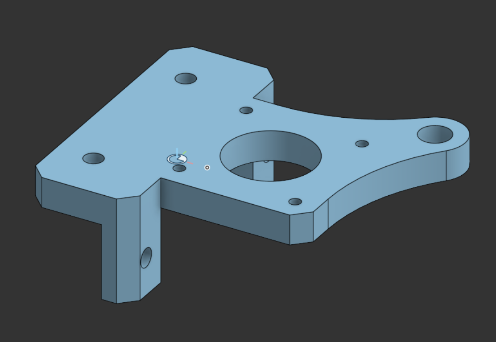

A configurable, universal Z axis mount. I still really like this mount and will be using it in the future after some revision to include some better structural support.
It can actually be played with [here](https://cad.onshape.com/documents/a25eb3393e530945c6474152/v/4382de752dc8200055f98b9c/e/8e87c3cf104fce85c0c0c45a). Open the configurations panel and you can swap between the configurations to see it.

## the beginning of the end (of my sanity)

I spent a few more hours fiddling with things until I got to this:

It's not good. Infact its quite bad. Part of my motivation for this machine was an idea I had going for a while with some of the other Hack Club 3D printing people: just steal the A1 Mini bed.

The thing I love the most about Bambulab printers is the build plates they use. They just _work_. So I wanted a machine with them. I figured a funny way to do this would be to just import a CAD model of the bed, make a mount for it, boom problem solved.

I failed to realize that as the bed heats up, it will expand and glue won't stand a chance to hold it to the machine. So I decided to redo it.

## i love open source

I did essentially all of the design while I was in a slack huddle. Parker, Evan, 1mon, Sidd, and Kai all told me that I should just use an existing kinematic mount for the bed and get a bed machined for cheap.

I didn't like this idea a whole lot, honestly. I wanted to be able to say that I designed my entire machine 100% from the ground up...... until I realized I had spent 8 hours at that point fighting the Bambu bed idea.

So I ditched the bed and started looking around. At first I thought about trying to adapt the Annex K3 kinematic mounts to leadscrews, but that sounded like a lot more work than its worth. I also looked at the RatRig V-Core 4 mounts, but those were sized very differently from mine and it would also be a pain to use those. Eventually, I discovered the Voron Trident's kinematic mounts. I absolutely love how these mounts look and the system they use to go together, it's a very nice experience. Using them in CAD was....hard. But hey, I did eventually get it going.

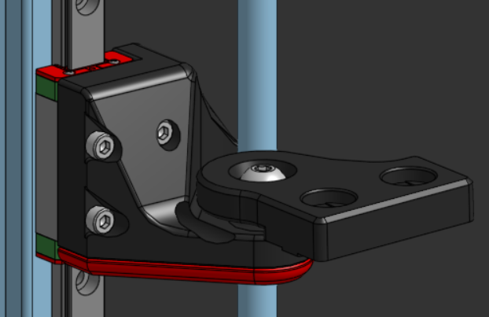

I also realized that there tends to be 2 systems for mounting the bed on a machine like this:

1. Injection mold a frame around a big metal thing to hold the bed on, like a bambu or visionminer machine.
2. Make a T shape with extrusions, bed goes on the extrusions.

Sadly, I don't have an injection molder, so I decided to go with the T shaped extrusions. I also redesigned my motor mount to fit the Voron Z mounts. I entirely plan to make my own Z brackets at some point and it will be the first upgrade this machine gets, but I just don't have the time or willpower to do that right now. I have a lot of ideas about it now though after studying other machines.

## gantries? what black magic is this

I tried for a while to design a gantry but oh. my. god. That sucked. I hated trying to do that. CoreXY belt paths are weird and trying to make a half-decent gantry was even weirder. I was also facing a lot of issues with overconstraining my assembly and overall it was a bad time.

I almost quit at this point---and then I decided to check my discord. Parker had been telling me over and over to make a machine with the Monolith gantry and I asked about it in a few popular discord servers. People thought that it was a great idea. Monolith is easily my favorite gantry right now and I'm glad to be able to use it in this machine. It even leaves an upgrade path to a AWD gantry setup which would be killer!

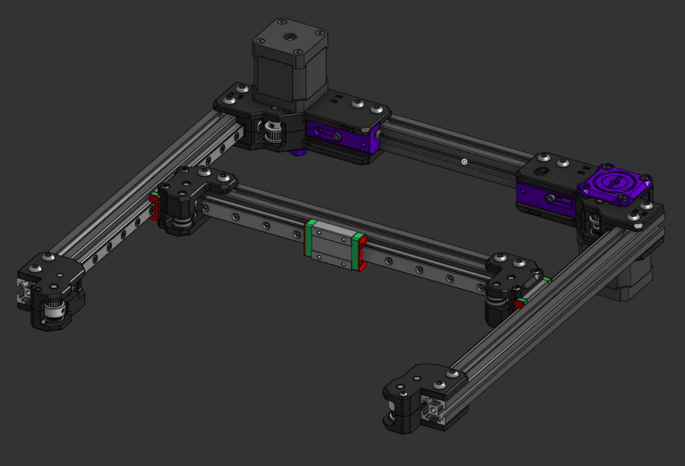

It's beautiful. It's absolutely beautiful. I've been wanting to get a voron 2.4 kit for my school and put Monolith on it just because I think it's amazing.

This gantry didn't come without problems, though. The source files aren't published anywhere, only generated individual step files of pieces of it. Monolith is an insanely configurable gantry system and I kinda assumed it would be parametric, but apparently it isn't.

The OnShape move face tool is interesting. I've never used it before right now and honestly, I like it. I could've probably used it to make a parametricish version of Monolith which honestly would be super cool and might happen anyways.

By this point I had spent about 10 hours on the machine and didn't feel great. I just wanted to be done with it.

## toolhead? no, I don't listen to tool very often

Toolheads are hard. I tried to make one off and on throughout this whole process and was really struggling. I've been planning to use a Bambu X1C clone hotend since the start of this just because its cheap and I know it works great, but trying to design a toolhead and make everything fit was not going my way. Onshape doesn't do 3d sketches either, so actually creating ducting for it was hard. I knew that I was just making something destined to be replaced and that this would suck, so I decided to just use an existing toolhead.

Intro Xol. Xol has what I call the stealthburner effect: people like it because it looks cool. It also has a characteristic unlike the stealthburner: It's a good toolhead.

I actually have a lot of ideas for custom toolheads. In the future, I hope to make a combination of the takeoff and kevender toolheads along with the Peopoly Lancer Long hotend. The Lancer Long is a very powerful hotend that can melt a lot of material in not a lot of time, while still looking good. Kevender and Takeoff both seem to have landed on the idea of just throwing a lot of CFM at parts, and I think that's funny. I have some ideas for a cpap kevender monstrosity that uses an industrial hepa air scrubber to pump absolutely insane amounts of air into the machine. This machine might actually end up one day having exclusively aux cooling and being made into a literal wind tunnel.

## the end

I spent a bit more time just adding corner braces I designed for another project and making sure that the system all works together. The end result is this:

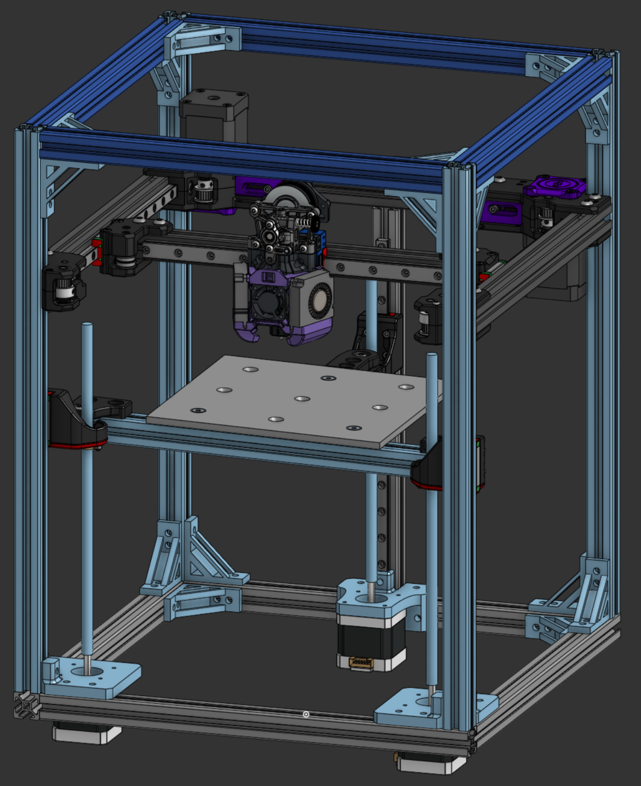

I really like how it looks. I don't plan to enclose it as I don't print materials that need enclosures every often, but if need be I can lasercut some wood. I do think enclosing it in a full, custom wooden box like those epoxy-wood tables would be sick.

## Sad news.

### the day: 8/6/2025. i think.

I got told no on my printer. Kinda fair and kinda expected, I used someone else's gantry, toolhead, and some other things.

So I'm going to redo it, because I still want a printer.

I've decided to move away from corexy and instead use double h-bot, mostly because it's funny and somewhat simple to design.

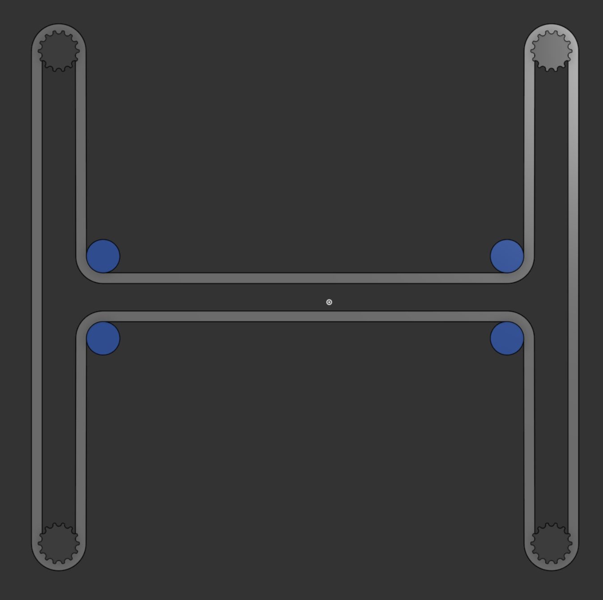

h-bot and corexy have the same kinematics, but h-bot causes diabolical levels of racking because..... honestly I don't know it's just what I've been told. If you put 2 h-bots on top of each other and drive them from opposite sides though, the racking issue goes away. And if you use just a gigantic 15mm pulley rather than normal 6mm pulleys, you get effectively AWD with a very simple beltpath.

## this took a long time.

### like, almost 10 hours.

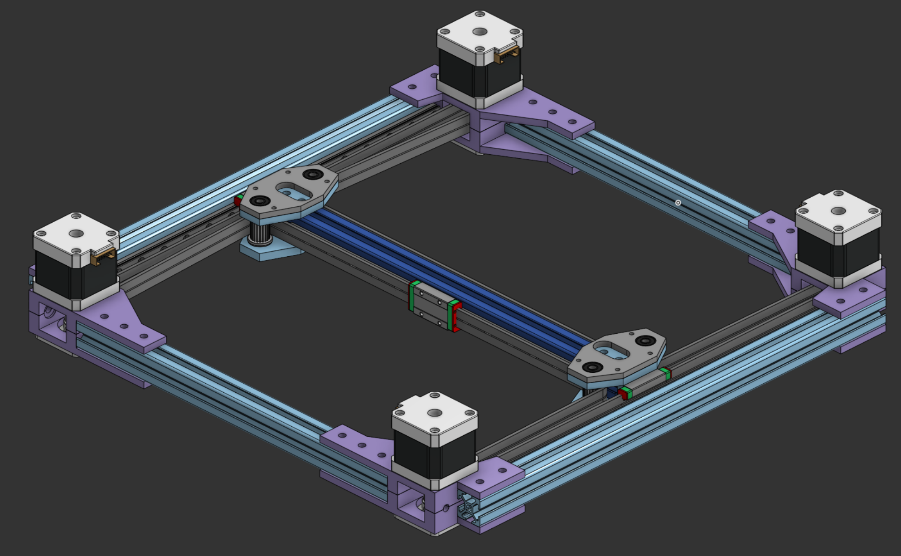

I made this in a few hours. I haven't taken many photos of the process that aren't just asking advice for if I'm being stupid, so here it is. There's a couple issues here that I eventually fixed but caused a lot of issues lol.

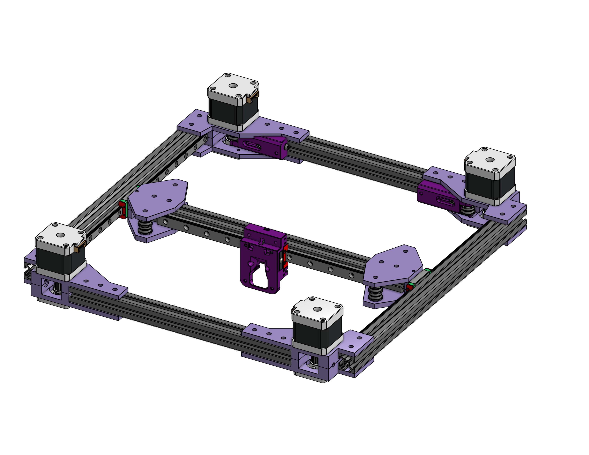

This is the finished gantry. Initially I decided to not use external tensioning and rely only on toolhead tensioning, and I still plan to do that mostly. However, I've also made a modded version of the Monolith tensioners that _should_ (hopefully) work on this. I worry about getting the tensioning on the 2 sides equal, the monolith tensioners should help a lot with that issue, if need be. They will also let me put ridiculous tension levels onto this if I so wish. Eventually, I think I'll upgrade this to a single 15mm GT2 belt, which is rated somewhere around needing 100lbs of force--a lot. More tension means more speed. This gantry system is capable of very easily adding 4 more motors to allow for double-awd. If I implemented all of this, there's a decent chance it would be the fastest gantry in existence, even compared to Monolith.

## toolhead time.

### this took forever. the amount of caffeine required borderlines Undercity.

#### somewhere around 12 hours total.

I think the biggest issue in getting rejected was a lack of a custom toolhead like most printers used.

I decided to move to the Peopoly Lancer Long hotend as it's more performant than the X1C hotend and the mounting is.... weird in a different way.

I based my design off of the [Archetype Breakneck with 15mm CPAP hose](https://www.printables.com/model/1076195-archetype-breakneck-mod-lancer-snakebite-flatmount/files) initially.

I kept the Xol mounting plate because honestly I just really like the way the belts attach to it.

I also switched to using the ProtoXTruder rather than an LGX lite, as it's a bit cheaper to build and much more popular.

I spent... so long figuring out how to get my ducts to work. It was mostly just trying things over and over until it worked. The loft tool wasn't working for some reason and it was overall a bad time.

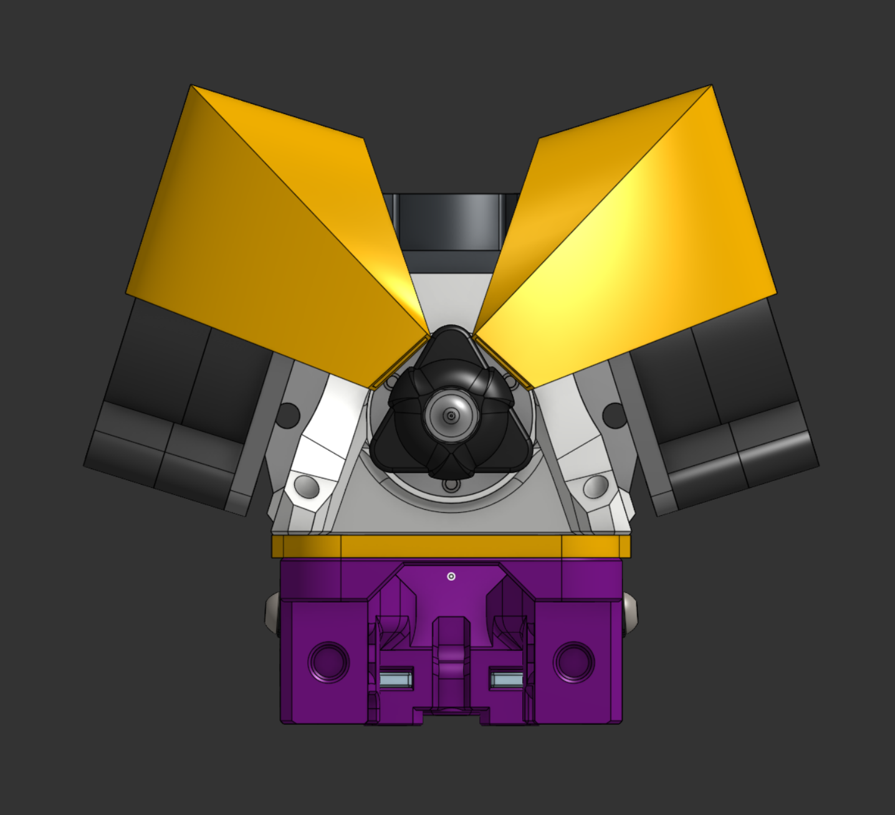
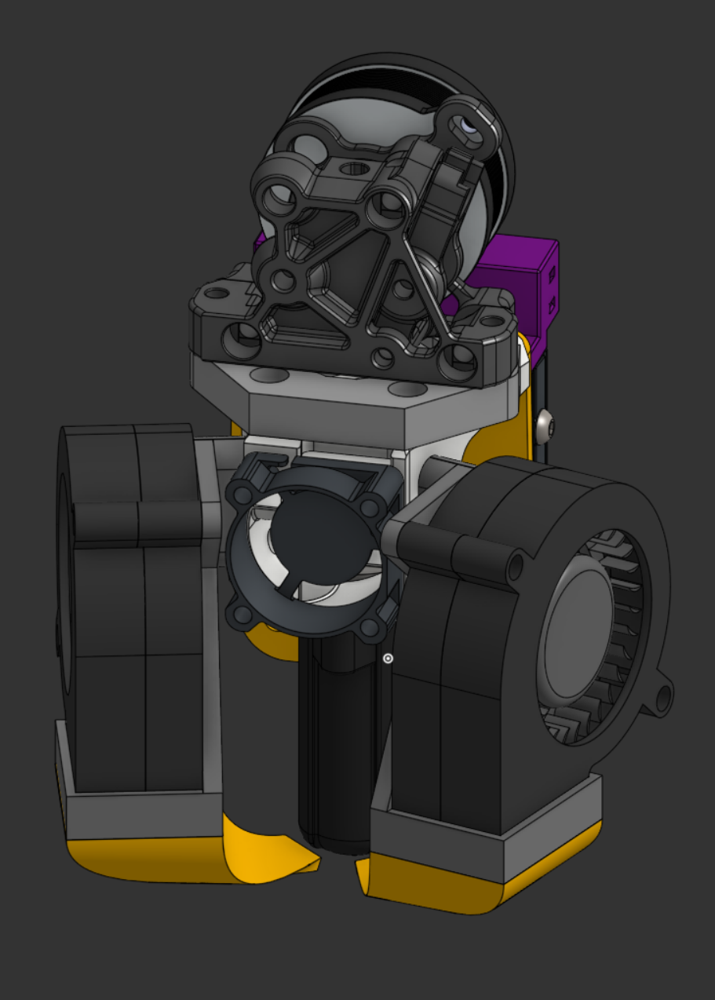

After making this monstrosity of a toolhead, I decided to go to sleep and think about a better one. Online 3d printing communities told me that this was a horrible, horrible disgusting toolhead that wouldn't cool very well, especially at the speeds this printer will be capable of.

So I went cpap. This hotend will be able to do 60mm/s^3 flow easily, CPAP is the only way I can think of to make bad ducts and still have it work.

Enter this behemoth.

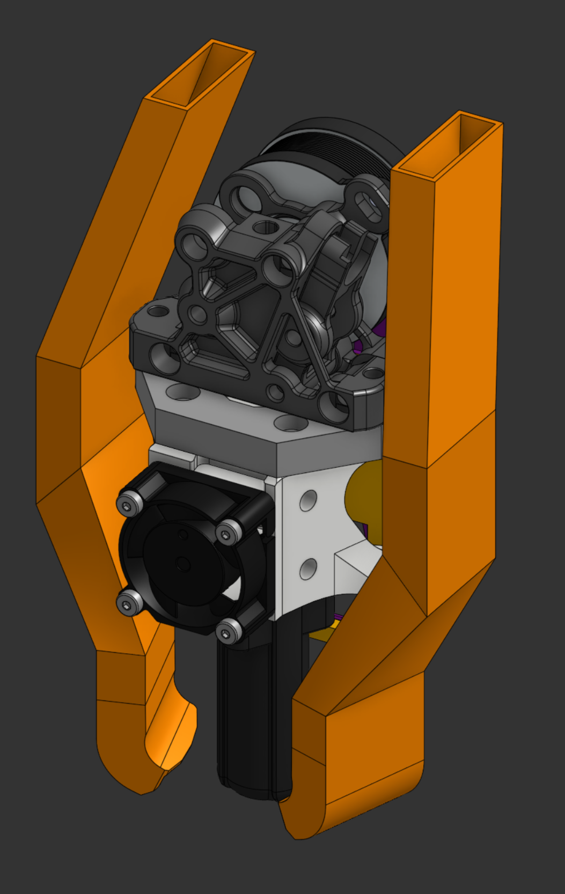

This was bad. I actually spent a lot of time on this thing, about 7 hours, and got it fully mounted and ready to go:

I still like this thing a bit. The brutalism aspect of it is nice.

However, it's kinda bad. Air doesn't like angles. Instead of that, I decided to try Loft again with my newfound duct anchors available and it went much, much better:

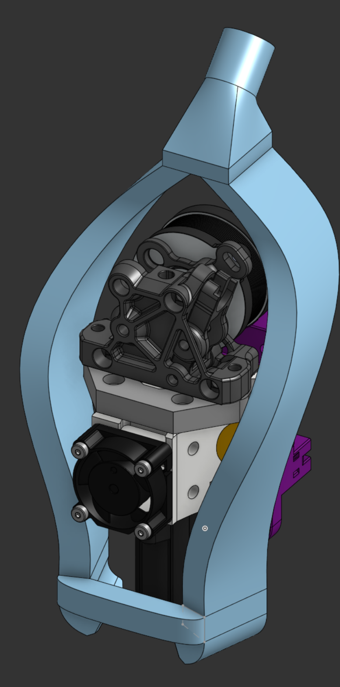

This thing still needed a lot of work, but that's all super boring stuff. Basically just mounting. It was a pain but not interesting.

Here's the finished product :3

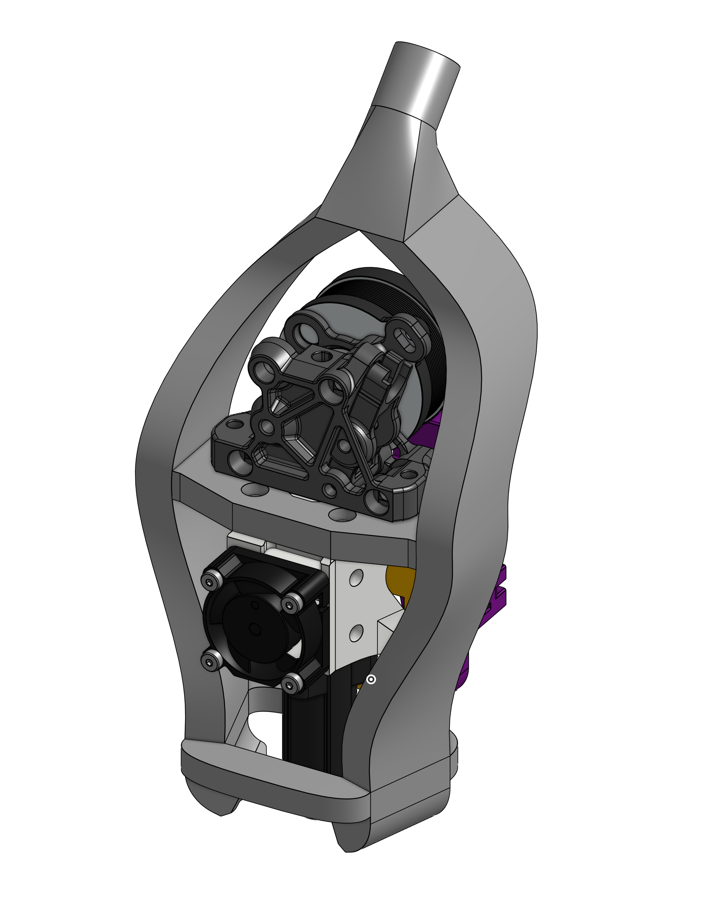

And that's basically it. I fought with the bed mounts for about an hour but I couldn't figure out how to mount the leadscrew nut and decided to just keep the Voron mounts. They're what I was trying to design the whole time anyway, but executed well. The magic of this printer is in its gantry, a fully custom and first of its kind double hbot. I'm quite proud of it.

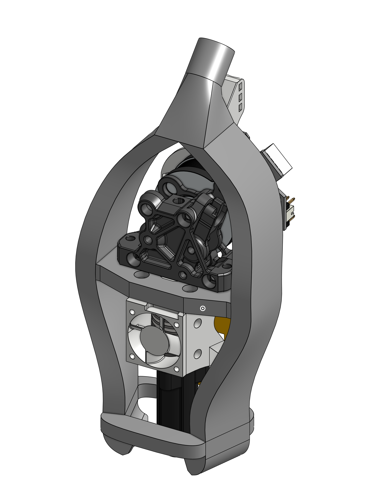
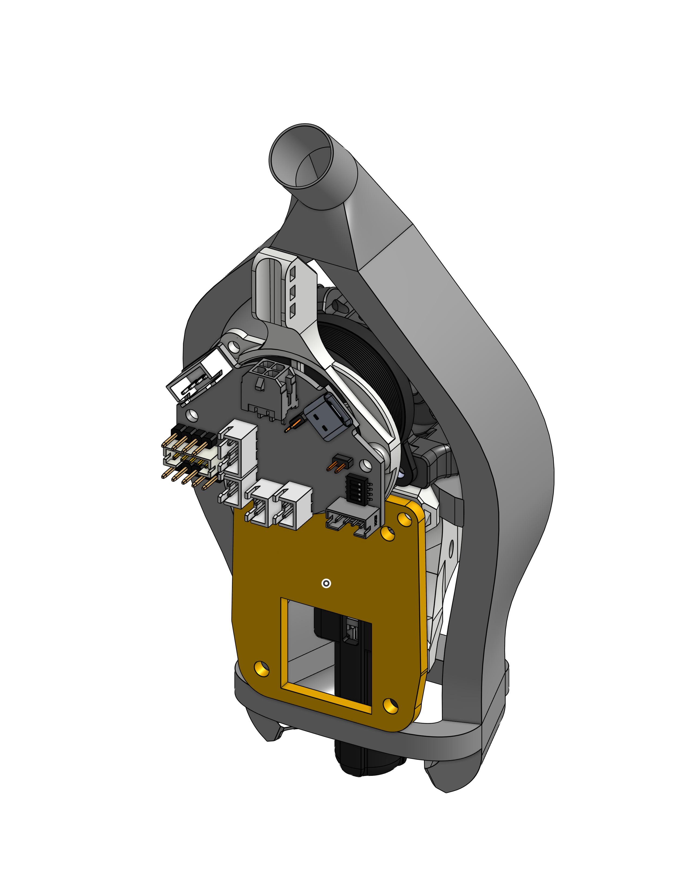

## One last thing.

Since this printer is no longer made in 24 hours, I can't call it the bagel24 anymore. I'll make a printer in 24 hours sometime in the future, but it isn't this one.

I give you: Monstrosity

## update: i'm dumb

So turns out I didn't implement double hbot correctly. The carriage has to be held on both sides by the upper and lower belt, not just one side. This is the thing that actually fixes the racking.

So...

Not going to deal with it right now. The tension should be capable of going high enough to eliminate a lot of the racking. If it's an issue, its a (somewhat) simple change.
