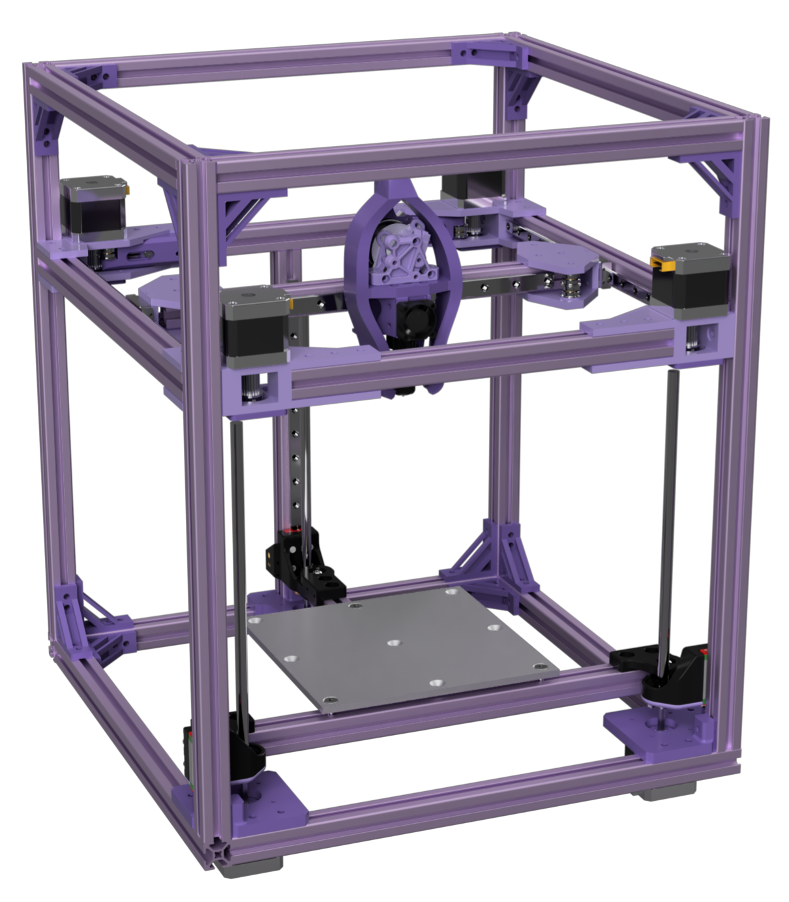

# Monstrosity

A printer designed in almost 24 hours.

# but why?

Long story short, I didn't realize I still had time to submit things to Hack Clubs Highway event--until I had almost exactly 24 hours left. So, I made this. This monstrosity is a double hbot with a custom toolhead based on the Peopoly Lancer Long, capable of using a Bambu Labs A1 Mini build plate.

### [CAD IS HERE](https://cad.onshape.com/documents/a25eb3393e530945c6474152/w/d83d10951cb1e8008c7f68e6/e/854bc744f46243b389612f55?renderMode=0&uiState=688c1bc2fb56dc36b3a2ea53)

# the bom

| PART                         | UNIT COST | QUANTITY | SPONSORED? | NOTES                                                                                                 | ROW COST | SOURCE                                                                                                                                                         |
| ---------------------------- | --------- | -------- | ---------- | ----------------------------------------------------------------------------------------------------- | -------- | -------------------------------------------------------------------------------------------------------------------------------------------------------------- |
| T8x4 Leadscrew 250mm         | $10.95    | 3        | FALSE      |                                                                                                       | $32.85   | https://www.aliexpress.us/item/3256806551253663.html                                                                                                           |
| MGN9H 316mm Linear Rail      | $9.97     | 2        | FALSE      | Not told of the final cost until checkout because of custom length                                    | $19.94   | https://limobearing.com/                                                                                                                                       |
| MGN9H 250mm Linear Rail      | $9.97     | 3        | FALSE      | Not told of the final cost until checkout because of custom length                                    | $29.91   | https://limobearing.com/                                                                                                                                       |
| MGN12H 265mm Linear Rail     | $10.71    | 1        | FALSE      | Not told of the final cost until checkout because of custom length                                    | $10.71   | https://limobearing.com/                                                                                                                                       |
| Linear Rail Shipping         | $39.00    | 1        | FALSE      |                                                                                                       | $39.00   | https://limobearing.com/                                                                                                                                       |
| 42mm Nema 17 Stepper Motor   | $4.72     | 7        | TRUE       | LDO Sponsorship                                                                                       | $0.00    | https://www.omc-stepperonline.com/e-series-nema-17-bipolar-42ncm-59-49oz-in-1-5a-42x42x38mm-4-wires-w-1m-cable-connector-17he15-1504s                          |
| HGX Gear Set                 | $15.06    | 1        | FALSE      |                                                                                                       | $15.06   | https://www.aliexpress.us/item/3256805725355339.html                                                                                                           |
| Extruder Motor               | $18.30    | 1        | TRUE       | LDO Sponsorship                                                                                       | $0.00    | https://biqu.equipment/products/biqu-orbiter-v1-5-extruder-dual-driver-gear-extrusion-3d-printer-parts-for-cr10-10s-ender3-3-pro-ender5?variant=40041793683554 |
| BTT EBB36                    | $9.40     | 1        | FALSE      |                                                                                                       | $9.40    | https://www.aliexpress.us/item/3256804056513768.html                                                                                                           |
| 10 pack of 1m 2020 extrusion | $44.01    | 1        | FALSE      |                                                                                                       | $44.01   | https://www.aliexpress.us/item/3256807024011071.html                                                                                                           |
| Peopoly Lancer Long          | $42.00    | 1        | FALSE      |                                                                                                       | $42.00   | https://peopoly.net/products/magneto-x-lancer-melt-zone                                                                                                        |
| Bed                          | $17.19    |          |            | Custom made by JLC or PCBWAY, probably sponsored.                                                     | $17.19   |                                                                                                                                                                |
| GT2 6mm Belt 1600mm Belt     | $9.95     | 2        | FALSE      |                                                                                                       | $19.90   | https://www.aliexpress.us/item/3256805605215455.html                                                                                                           |
| Roborock CPAP Blower         | $15.76    | 1        | FALSE      |                                                                                                       | $15.76   | https://www.aliexpress.us/item/3256805903154627.html                                                                                                           |
| PEI Plate and Magnet         | $26.76    | 1        | FALSE      |                                                                                                       | $26.76   | https://www.aliexpress.us/item/3256809109559068.html                                                                                                           |
| 4010 Hotend Fan              | $1.53     | 1        | FALSE      |                                                                                                       | $1.53    | https://www.aliexpress.us/item/3256803185681643.html                                                                                                           |
| BTT Octopus w/ 6 drivers     | $65.00    | 1        | TRUE       | I'll be asking many companies for a sponsorship for a mainboard or using 2 of the ones I already own. | $0.00    | https://biqu.equipment/products/bigtreetech-octopus-v1-1?variant=39749193990242                                                                                |
| 15mm Pulley                  | $3.33     | 4        | FALSE      |                                                                                                       | $13.32   |                                                                                                                                                                |
| F695 Flanged Bearing 10x     | $5.25     | 2        | FALSE      |                                                                                                       | $10.50   |                                                                                                                                                                |
| D5x30 Smooth Pin             | $11.50    | 1        | FALSE      |                                                                                                       | $11.50   |                                                                                                                                                                |
| ---------------------------- | --------- | -------- | ---------- | ----------------------------------------------------------------------------------------------------- | -------- | -------------------------------------------------------------------------------------------------------------------------------------------------------------- |
| Screws, nuts, pulleys, etc   | $0.00     | 0        | TRUE       | I own it already or will pay out of pocket                                                            |          |                                                                                                                                                                |
| Filament                     | $0.00     | A lot    | TRUE       | Polymaker should be sponsoring with ASA                                                               |          |                                                                                                                                                                |

The overall cost is $359.34. This does not include the steppers, as I already have most of them and can get many sponsored to me. If LDO is kind enough, I'll make a double AWD version of this, though I'll need a secondary mainboard for the bed.
If PCBWAY is gracious and sponsors the bed, the full cost is $342.15.

# wiring diagram

# Credits

Thanks to the Voron team for publishing their kinematic Z mounts under the GPL license as part of the Voron Trident. This machine drew a lot of inspiration from the way the bed was used on the Trident.

[The Monolith gantry by CloakedWayne](https://github.com/CloakedWayne/Monolith_Gantry_V2-VT) was previously used in this design and a modified version of the 6mm belt tensioning system is also used.
